<!-- Heading -->
<h3 align="center"> Hi there! I'm Jacob!  </h3>

  
  

## Technologies I Use:

- **Computer Vision**: Leveraging image processing and deep learning to enable machines to interpret and understand visual data.
- **AWS**: Utilizing Amazon Web Services for scalable and robust cloud computing solutions.
- **Azure**: Employing Microsoft Azure for computer vision, chatbots, machine learning models, document intelligence, etc.
- **Tensorflow**: Implementing machine learning models using this powerful open-source library.
- **Pytorch**: Building and training neural networks with this flexible and efficient deep learning framework.
- **Robotics**: Developing intelligent robotic systems for the automotive and food industries.
- **Geospatial Data**: Analyzing and visualizing geographical data to uncover spatial patterns and insights.
- **RAG (Retrieval-Augmented Generation)**: Enhancing generative models with external knowledge retrieval for more accurate and relevant outputs.
- **LLMs (Large Language Models)**: Working with advanced language models for natural language understanding and generation.
- **Web Scraping**: Extracting valuable data from websites for analysis and insights.
- **Agile Methodologies**: Applying agile principles for efficient project management and development.
- **Prompt Engineering**: Crafting effective prompts to improve the performance of AI models.

## Certifications:

  <table>
    <tr>
      <td align="center">
         
        
      </td>
      <td align="center">
         
        
      </td>
      <td align="center">
        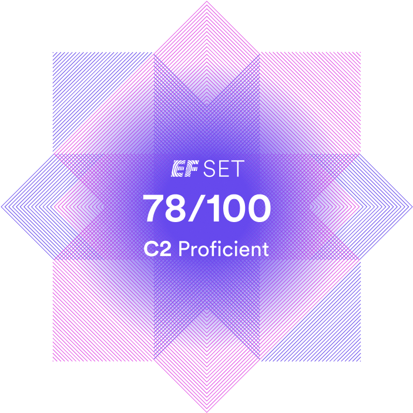 
        
      </td>
      <td align="center">
        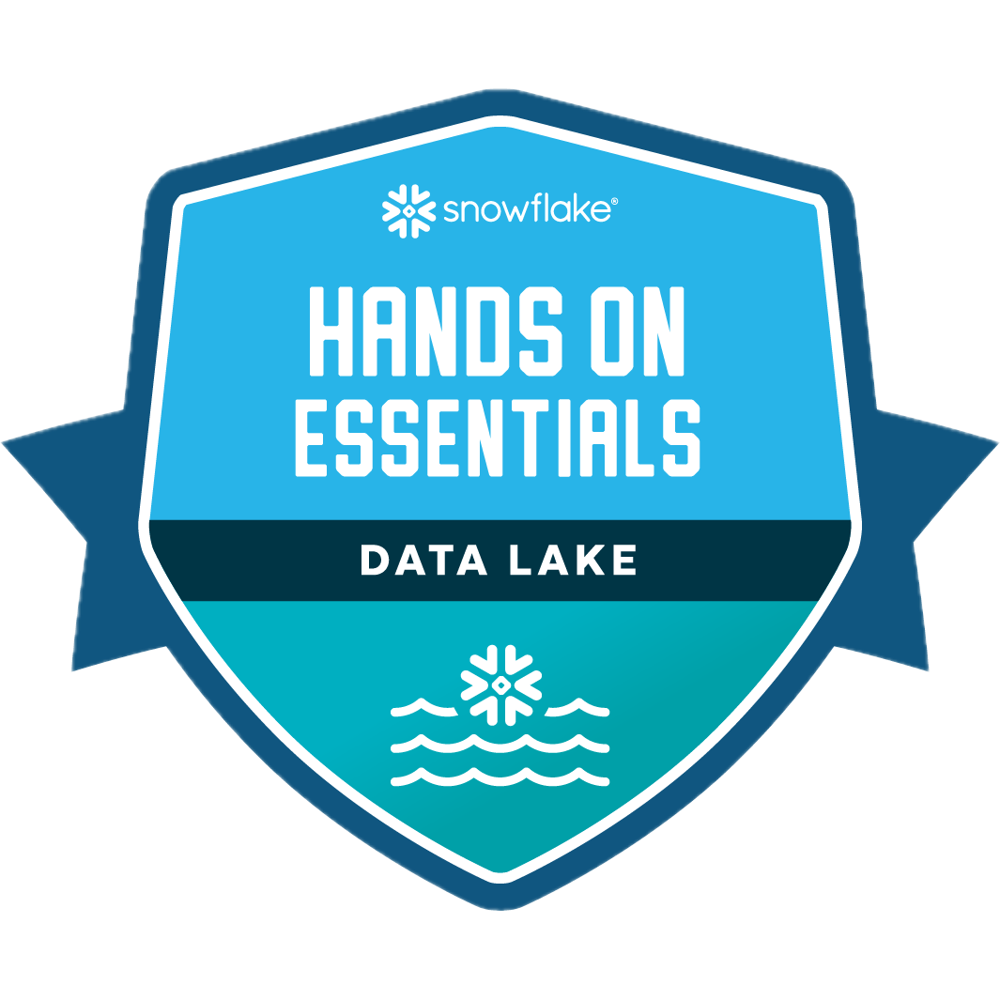 
        
      </td>
    </tr>
    <tr>
      <td align="center">
        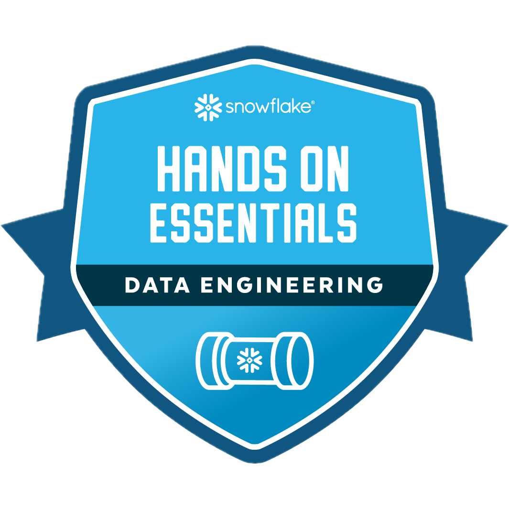 
        
      </td>
      <td align="center">
        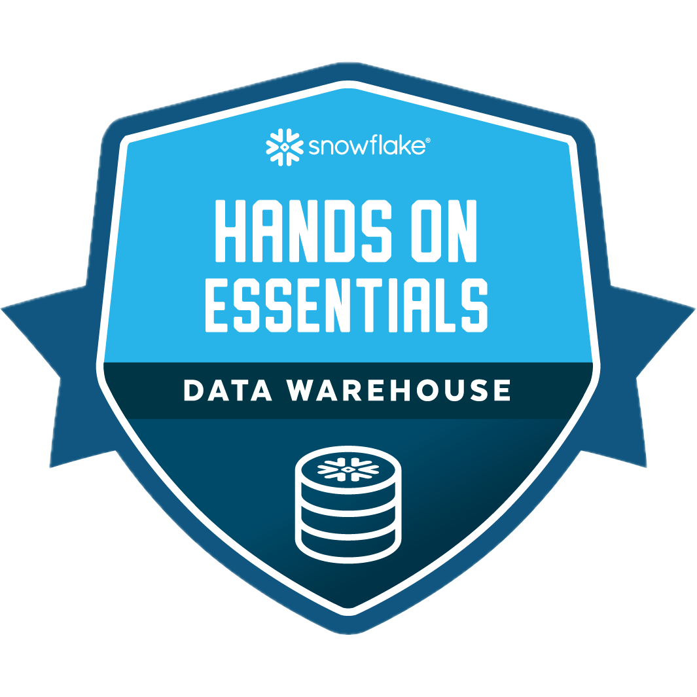 
        
      </td>
      <td align="center">
        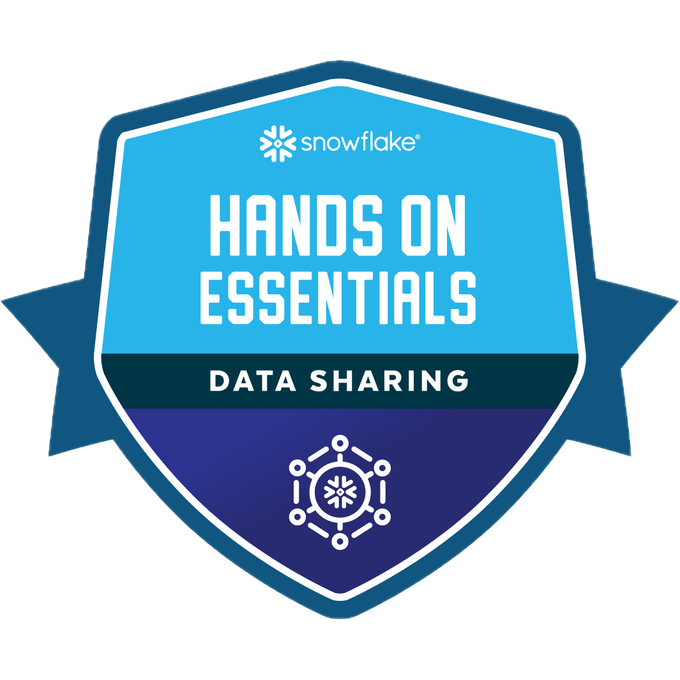 
        
      </td>
      <td align="center">
        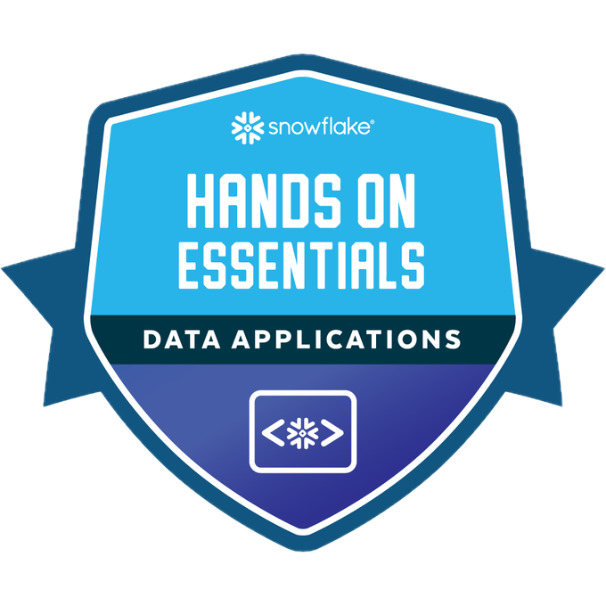 
        
      </td>
    </tr>
  </table>

## Companies I'm Currently Working At
Participation in the development of a Generative Artificial Intelligence platform to
generate creative and customized content for Nike & Adidas products.
Participation in the development of chatbots, using Langchain, ChromaDB, Postgres,
vector databases, and RAG techniques.
Development of an ML algorithm to determine pedestrian traffic in Spain.
<table align="center">
  <tr>
    <td align="center" width="150px">
      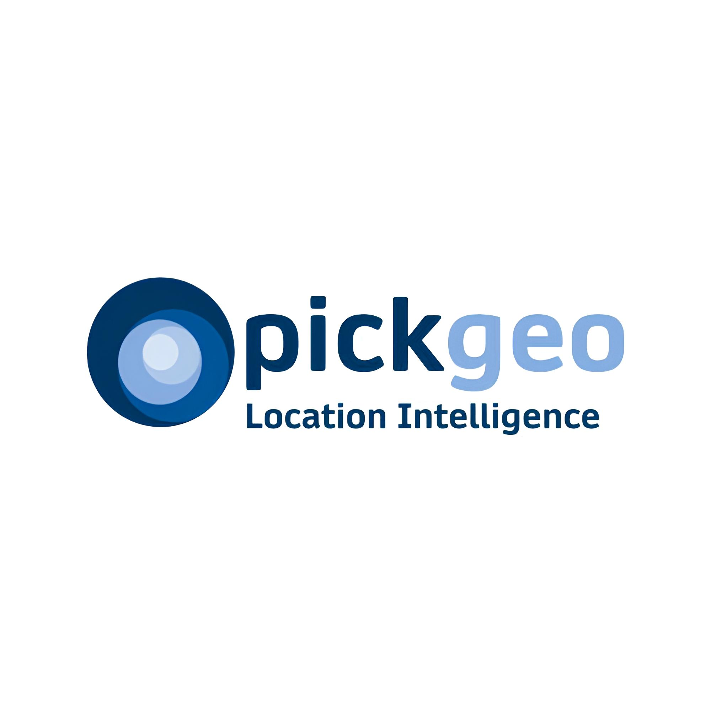
    </td>
    <td>
      <ul>
        <li>Conducted data scraping using Selenium and BeautifulSoup</li>
        <li>Developed a GenAI platform to create innovative and customized content for Nike & Adidas products</li>
        <li>Engineered chatbots utilizing RAG and multiple LLMs with Langchain and various vector stores</li>
        <li>Designed an algorithm to calculate pedestrian traffic for streets across Spain</li>
      </ul>
    </td>
    </tr>
    <tr>
    <td align="center" width="150px">
      
    </td>
    <td>
      <ul>
        <li>Developed document intelligence algorithms with LLMs for real estate purchase agreements</li>
        <li>Built data pipelines and ETL processes</li>
        <li>Engineered prompts for auto-classifying OCR extracted data</li>
      </ul>
    </td>
    </tr>
    <tr>
    <td align="center" width="150px">
      
    </td>
    <td>
      <ul>
        <li>Developed bin picking systems for Stellantis Vigo</li>
        <li>Trained a DL model to auto-detect specific vehicle parts during assembly for Stellantis Zaragoza</li>
        <li>Adapted the shark peeling process to an ergonomic procedure using cobots for Orpagu</li>
      </ul>
    </td>
  </tr>
</table>

## Clients I Developed For

<table align="center">
  <tr>
    <td align="center" width="200px">
      
    </td>
    <td align="center" width="200px">
      
    </td>
    <td align="center" width="200px">
      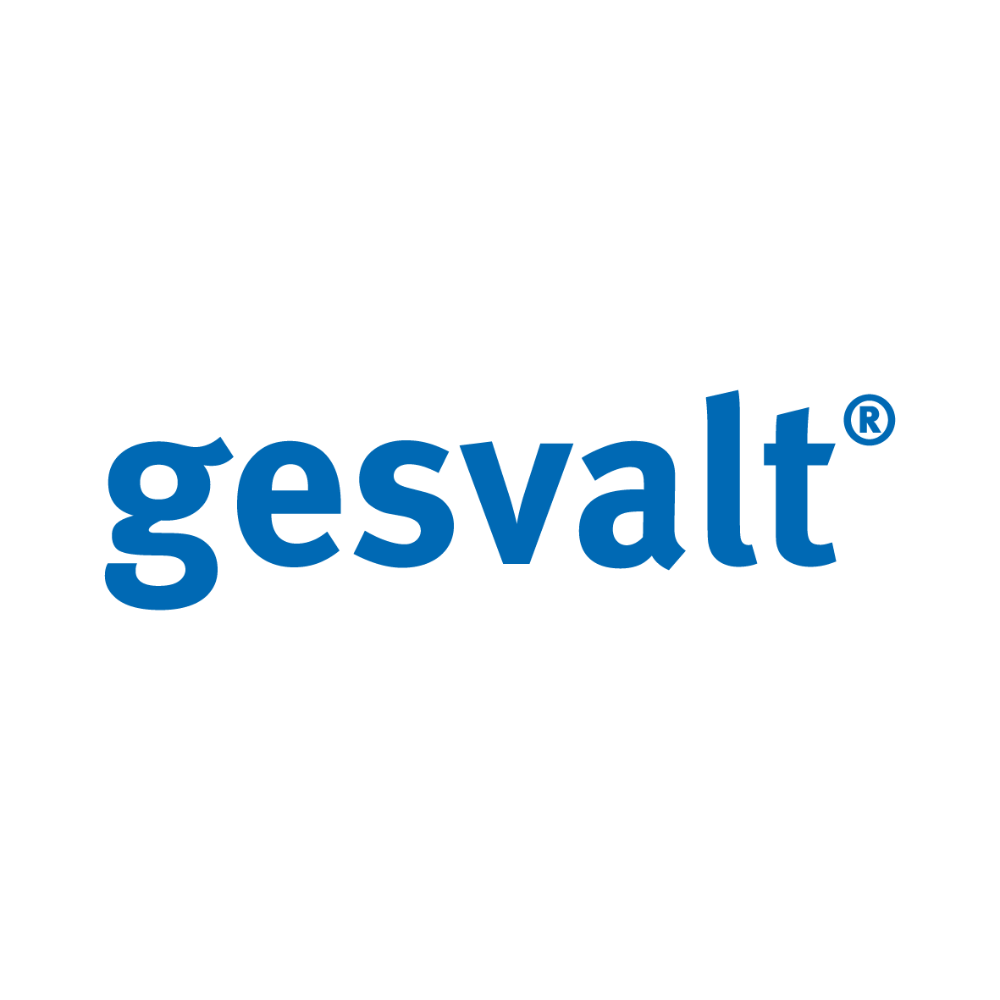
    </td>
    <td align="center" width="200px">
      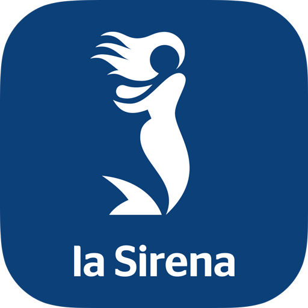
    </td>
    <td align="center" width="200px">
      
    </td>
  </tr>
  <tr>
    <td align="center" width="200px">
      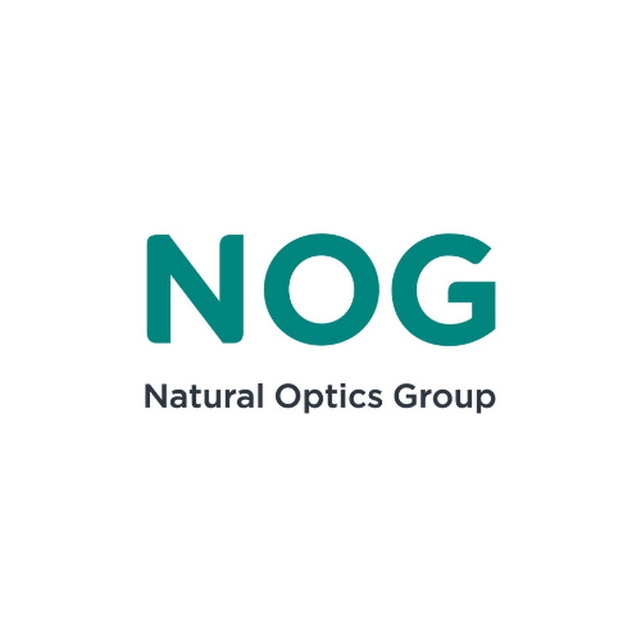
    </td>
    <td align="center" width="200px">
      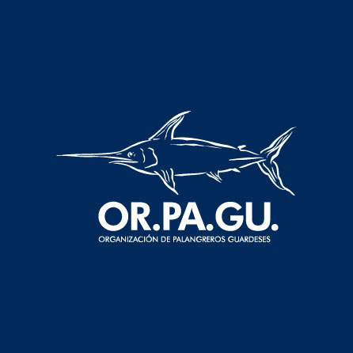
    </td>
    <td align="center" width="200px">
      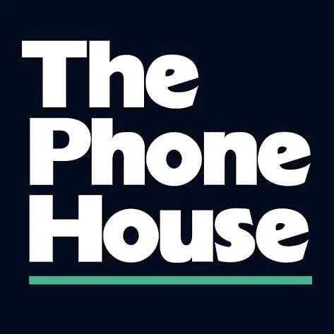
    </td>
    <td align="center" width="200px">
      
    </td>
    <td align="center" width="200px">
      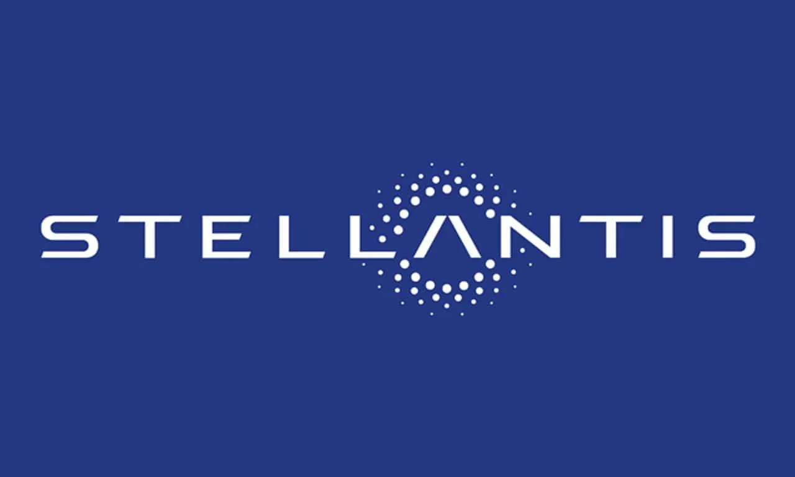
    </td>
  </tr>
</table>